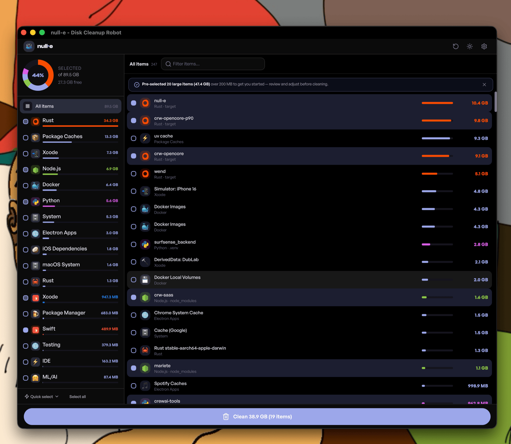

<div align="center">


# null-e

**Disk cleanup for developers — clean node_modules, target, .venv, Docker, Xcode caches and 50+ cache types**

[](https://github.com/us/null-e/actions/workflows/ci.yml)
[](LICENSE)

[Download](#download) • [Quick Start](#quick-start) • [Docs](https://us.github.io/null-e) • [Changelog](CHANGELOG.md)

<br />



</div>

---

`/dev/null` + Wall-E = **null-e** — like the adorable trash-compacting robot, null-e tirelessly cleans up developer junk and sends it where it belongs.

> **Reclaim 100+ GB** — most developer machines accumulate tens of gigabytes of stale `node_modules`, `target/`, `.venv`, Docker images, and IDE caches.

## Download

### Desktop App (GUI)

| Platform | Download |
|----------|----------|
| **macOS (Apple Silicon)** | [Download .dmg](https://github.com/us/null-e/releases/latest/download/null-e_0.4.2_aarch64.dmg) — M1/M2/M3/M4 |
| **macOS (Intel)** | [Download .dmg](https://github.com/us/null-e/releases/latest/download/null-e_0.4.2_x64.dmg) |
| **Windows** | [Download .exe](https://github.com/us/null-e/releases/latest/download/null-e_0.4.2_x64-setup.exe) — 64-bit |
| **Linux (Ubuntu/Debian)** | [Download .deb](https://github.com/us/null-e/releases/latest/download/null-e_0.4.2_amd64.deb) |
| **Linux (Universal)** | [Download .AppImage](https://github.com/us/null-e/releases/latest/download/null-e_0.4.2_amd64.AppImage) |

### macOS Installation Note

null-e is distributed as an unsigned/non-notarized `.dmg` (no Apple Developer Program). macOS
Gatekeeper will block it on first launch — this is expected. Two ways to open it:

**1. Open Anyway (no Terminal)**
1. Drag **null-e.app** to **/Applications** and double-click it.
2. macOS says it can't verify the developer. Open **System Settings → Privacy & Security**,
   scroll to the bottom, and click **Open Anyway** next to null-e.
3. Confirm **Open**. You only need to do this once per version.

**2. Terminal (power users)**
```bash
# Drag null-e.app to /Applications, then run:
xattr -rd com.apple.quarantine /Applications/null-e.app
open /Applications/null-e.app
```

#### Full Disk Access

To clean system and other-app caches, null-e needs **Full Disk Access**:
**System Settings → Privacy & Security → Full Disk Access → enable null-e**, then **relaunch the
app** (macOS only applies the grant to a freshly launched process). null-e's in-app guide walks
you through this.

> **Heads up:** because the app is unsigned, **updating to a new version can reset the Full Disk
> Access grant** — macOS ties the permission to each build. If cleaning suddenly fails after an
> update, just re-enable null-e in Full Disk Access and relaunch. (Building from source with a
> stable self-signed certificate avoids this — see the release workflow.)

### CLI (command-line)

```bash
cargo install null-e
null-e sweep
```

## What's New

### v0.4.2

### Features

* **core:** faster, safer scanning and trash reclamation ([1c273c7](https://github.com/us/null-e/commit/1c273c7a07ea51ae84e1623e8e7255a2c67027cc))
* **ui:** Pastel Bento redesign and sidebar results layout ([8493346](https://github.com/us/null-e/commit/8493346f7d888ceac34f7264ecc13bc9b39132b6))

See [CHANGELOG.md](CHANGELOG.md) for the full release history.


## Changelog

See [CHANGELOG.md](CHANGELOG.md) for the full release history.


## Why null-e?

| Category | Examples | Typical Size |
|----------|----------|-------------|
| **Project Artifacts** — `node_modules`, `target`, `.venv`, `build` | Node.js, Rust, Python, Go, Java, .NET, Swift | 10-100 GB |
| **Global Caches** — npm, pip, cargo, go, maven, gradle | All major package managers | 5-50 GB |
| **Xcode** — DerivedData, Simulators, Archives | iOS/macOS development | 20-100 GB |
| **Docker** — Images, Containers, Volumes, Build Cache | Container workflows | 10-100 GB |
| **Android** — AVD, Gradle, SDK Components | Android development | 5-30 GB |
| **ML/AI** — HuggingFace, Ollama, PyTorch cache | Machine learning | 10-100 GB |
| **IDE Caches** — JetBrains, VS Code, Cursor | All major IDEs | 2-20 GB |
| **More** — Homebrew, Electron, Game Dev, Cloud CLI, macOS System | Everything else | 1-100 GB |

## Features

- **Multi-language Support** — Node.js, Rust, Python, Go, Java, .NET, Swift, Ruby, PHP and more
- **Git Protection** — 4 levels (none/warn/block/paranoid) to prevent deleting uncommitted work
- **Safe Deletion** — Moves to trash by default with recovery option, dry-run mode
- **Parallel Scanning** — Fast multi-threaded directory traversal with rayon + walkdir
- **Interactive TUI** — 18 scan modes, keyboard navigation, live progress with ratatui
- **Analysis Tools** — Find stale projects, duplicate dependencies, optimize git repos
- **System Cleaners** — Xcode, Docker, Android, ML/AI, IDE, Homebrew, Electron, Cloud CLI, and more
- **Configurable** — TOML config file, CLI flags override, JSON output support
- **Cross-Platform** — macOS, Linux, Windows

## Installation

### Using Cargo

```bash
cargo install null-e
```

### Pre-built Binaries

Download from [GitHub Releases](https://github.com/us/null-e/releases):

| Platform | File |
|----------|------|
| macOS ARM | `null-e-darwin-aarch64.tar.gz` |
| macOS Intel | `null-e-darwin-x86_64.tar.gz` |
| Linux x86_64 | `null-e-linux-x86_64.tar.gz` |
| Linux x86_64 (musl) | `null-e-linux-x86_64-musl.tar.gz` |
| Linux ARM | `null-e-linux-aarch64.tar.gz` |
| Windows | `null-e-windows-x86_64.zip` |

### Package Managers

```bash
# Homebrew (macOS/Linux)
brew install null-e

# AUR (Arch Linux)
yay -S null-e

# Scoop (Windows)
scoop bucket add us https://github.com/us/scoop-bucket
scoop install null-e
```

### Docker

```bash
docker run -v $(pwd):/workspace ghcr.io/us/null-e
```

### From Source

```bash
git clone https://github.com/us/null-e.git
cd null-e
cargo install --path .
```

## Quick Start

```bash
# Scan current directory for cleanable artifacts
null-e

# Deep sweep — find ALL cleanable items across your system
null-e sweep

# Clean global developer caches (npm, pip, cargo, etc.)
null-e caches

# Interactive TUI mode
null-e tui

# Find stale projects not touched in 6 months
null-e stale ~/projects

# Dry run — see what would be deleted
null-e clean ~/projects --dry-run
```

## Commands

### Core

| Command | Description |
|---------|-------------|
| `null-e` | Scan current directory for project artifacts |
| `null-e scan` | Scan with detailed output |
| `null-e clean` | Clean found artifacts (interactive) |
| `null-e sweep` | Deep scan for ALL cleanable items |
| `null-e caches` | Manage global developer caches |
| `null-e tui` | Launch interactive terminal UI |

### System Cleaners

| Command | Description |
|---------|-------------|
| `null-e xcode` | Xcode artifacts (DerivedData, Simulators, Archives) |
| `null-e android` | Android development artifacts |
| `null-e docker` | Docker resources (images, volumes, build cache) |
| `null-e ml` | ML/AI model caches (HuggingFace, Ollama, PyTorch) |
| `null-e ide` | IDE caches (JetBrains, VS Code, Cursor) |
| `null-e homebrew` | Homebrew caches |
| `null-e ios-deps` | iOS dependency caches (CocoaPods, Carthage, SPM) |
| `null-e electron` | Electron app caches (Slack, Discord, Teams) |
| `null-e gamedev` | Game development caches (Unity, Unreal, Godot) |
| `null-e cloud` | Cloud CLI caches (AWS, GCP, Azure, kubectl, Terraform) |
| `null-e macos` | macOS system caches |

### Analysis

| Command | Description |
|---------|-------------|
| `null-e git-analyze` | Find large `.git` repos, suggest `git gc` |
| `null-e stale` | Find projects not touched in months |
| `null-e duplicates` | Find duplicate dependencies |

## Architecture

```
     .---.
    |o   o|
    |  ^  |    ┌──────────────────────────────────────────────────┐
    | === |    │                       CLI                         │
    `-----'    ├──────────────────────────────────────────────────┤
     /| |\     │                    Core Engine                    │
               │  ┌──────────┐  ┌──────────┐  ┌──────────┐        │
               │  │ Scanner  │  │ Cleaner  │  │ Analysis │        │
               │  │          │  │          │  │  Tools   │        │
               │  └──────────┘  └──────────┘  └──────────┘        │
               ├──────────────────────────────────────────────────┤
               │                    Modules                        │
               │  ┌────────┐ ┌────────┐ ┌────────┐ ┌────────┐     │
               │  │Plugins │ │Cleaners│ │ Caches │ │ Docker │     │
               │  │(langs) │ │(system)│ │(global)│ │        │     │
               │  └────────┘ └────────┘ └────────┘ └────────┘     │
               └──────────────────────────────────────────────────┘
```

## Configuration

Create `~/.config/null-e/config.toml`:

```toml
[general]
default_paths = ["~/projects", "~/work"]

[scan]
max_depth = 10
min_size = 1000000  # 1 MB

[clean]
delete_method = "trash"
protection_level = "warn"

[ui]
sort_by = "size"
use_icons = true
```

## Contributing

1. Fork the repository
2. Create your feature branch (`git checkout -b feat/amazing-feature`)
3. Commit your changes using conventional commits
4. Push to the branch (`git push origin feat/amazing-feature`)
5. Open a Pull Request

## License

[WTFPL](LICENSE) — Do What The Fuck You Want To Public License.

## Disclaimer

**null-e** is provided "as-is" without warranty of any kind. The authors are
not responsible for any data loss resulting from the use of this software.

- **Always keep backups** of important work before running cleanup operations
- **Use `--dry-run`** to preview what will be deleted before committing
- **Trash mode** (default) allows recovery, but is not guaranteed on all filesystems
- **Permanent delete** is irreversible — use with extreme caution
- This tool is designed for developers who understand the artifacts being cleaned
